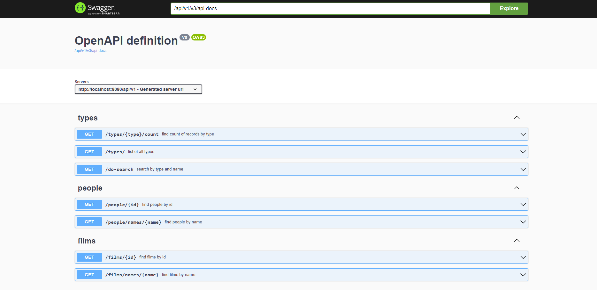

# starwar-api

A client service for StarWar Apis


https://swapi.dev/


## Features

- Get the total count of records for given types (species, planets, vehicles etc..)
- Search the records on type and their respective name texts

## Docker Image

```
docker pull pamperay/starwar-api:latest
```

## Access Swagger-UI

Pull & Run the docker image and access the application swagger link below.


```
http://localhost:8080/api/v1/swagger-ui.html
```
Swagger UI



